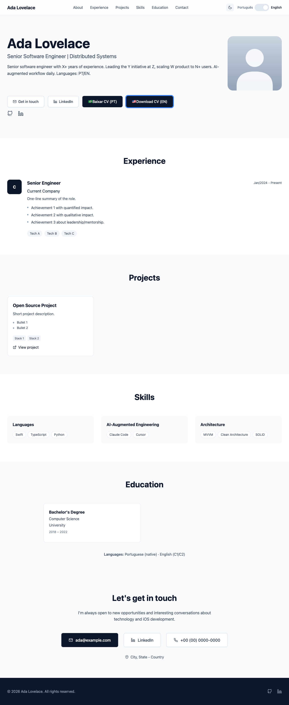
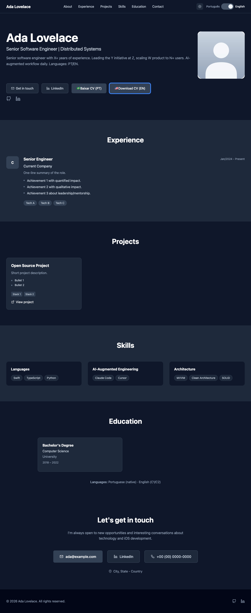

# resume-site

> One JSON, one bilingual portfolio site, six ATS-friendly PDF templates.

A single-source-of-truth resume system. You edit one `resume.json` (PT/EN), and the build produces:

- A bilingual web portfolio (Next.js + Tailwind, dark/light, mobile-first)
- Six PDF resume variants tuned for different recruiting funnels (ATS keyword scans, technical leadership case studies, dense skill matrices)
- A `manifest.json` with the build timestamp so download links bust cache automatically

The data layer is decoupled from the template: this repo contains the renderer; your personal `resume.json` lives in a separate (typically private) repository and is fetched at build time.

## Screenshots

| Light | Dark |
|---|---|
|  |  |

The screenshots above are rendered from [`data/resume.example.json`](data/resume.example.json).

## How it works

```
┌─────────────────────┐    fetched at build       ┌──────────────────────┐
│  resume-data (priv) │  ────────────────────►    │  resume-site (this)  │
│   resume.json       │                           │  templates + Next.js │
│   photo.jpg         │                           └──────────┬───────────┘
└─────────────────────┘                                      │
                                                             ▼
                                          ┌────────────────────────────────┐
                                          │  out/                          │
                                          │   ├ index.html (web portfolio) │
                                          │   ├ download/ (file index)     │
                                          │   └ pdfs/                      │
                                          │      ├ pietro-cv-pt.pdf        │
                                          │      ├ pietro-cv-en.pdf        │
                                          │      └ ... (6 variants)        │
                                          └────────────────────────────────┘
```

## Getting started

```bash
git clone https://github.com/pietro1704/resume-site.git
cd resume-site
npm install

# Quick preview using the example data
npm run dev          # → http://localhost:3000
npm run pdf          # → ./pdfs/*.pdf, ./public/pdfs/*.pdf
```

By default the build looks for resume data in this order, picking the first that exists:

1. `data/private/resume.json` (created automatically when `RESUME_DATA_REPO`/`RESUME_DATA_TOKEN` env vars are set; see [Deploy](#deploy))
2. `data/resume.json` (a local-only file you create yourself; gitignored)
3. `data/resume.example.json` (committed placeholder)

So you can either:
- **(a)** symlink your real data: `ln -s ~/path/to/your/resume.json data/resume.json`
- **(b)** paste it directly: `cp ~/path/to/your/resume.json data/resume.json`
- **(c)** point the build at a private Git repo via env vars (recommended for CI/Cloudflare/Vercel deploys)

The same fallback applies to your photo (`public/photo.jpg`). A neutral `public/photo.placeholder.jpg` ships as the safe default.

## Customizing templates

PDF templates live in `scripts/generate-resumes.js`. They share helpers (`renderHeader`, `renderExperience`, `renderEducation`, …) and a single CSS block. Each template is just a composition:

```js
function generateATSTemplate(data, lang) {
  const isPt = lang === 'pt';
  return renderHead(`${data.basics.name} — Resume`) +
    renderHeader(data) +
    renderSummary(data, isPt) +
    renderExperience(data, lang, isPt) +
    renderSkills(data, isPt, { layout: 'inline' }) +
    renderProjects(data, isPt) +
    renderEducation(data, isPt) +
    renderLanguages(data, isPt) +
    `</body></html>`;
}
```

Add a new variant by writing a new `generateXxx()` function and registering it in the `templates` array near the bottom of the file. Run `npm run pdf` and check the output in `pdfs/`.

The web portfolio (`app/page.js`) reads the same `data/resume.json`. All copy is parameterized — there's no name, label, or summary hardcoded outside of `resume.json`.

## Deploy

Recommended target: **Cloudflare Pages** (works free for personal sites; Puppeteer runs in build).

1. Connect your `resume-site` fork to Cloudflare Pages.
2. Build command: `npm run build`
3. Build output directory: `out`
4. Environment variables (if you want the build to pull data from a private repo):
   - `RESUME_DATA_REPO` — e.g. `your-handle/resume-data`
   - `RESUME_DATA_TOKEN` — a fine-grained GitHub PAT with read access to that repo
   - `RESUME_DATA_REF` — branch/tag/sha (optional; defaults to `master`)

The `prebuild` step runs `scripts/fetch-private-data.js`, which clones the private repo into `data/private/` (gitignored) before the rest of the build kicks in. If the env vars aren't set, the script silently no-ops and the build falls back to whatever data is on disk.

## Tech

- [Next.js 14](https://nextjs.org/) (static export)
- [Tailwind CSS](https://tailwindcss.com/)
- [Puppeteer](https://pptr.dev/) for HTML → PDF
- [archiver](https://www.npmjs.com/package/archiver) for the all-in-one ZIP

## License

[MIT](LICENSE) — free to fork and adapt for your own resume.
